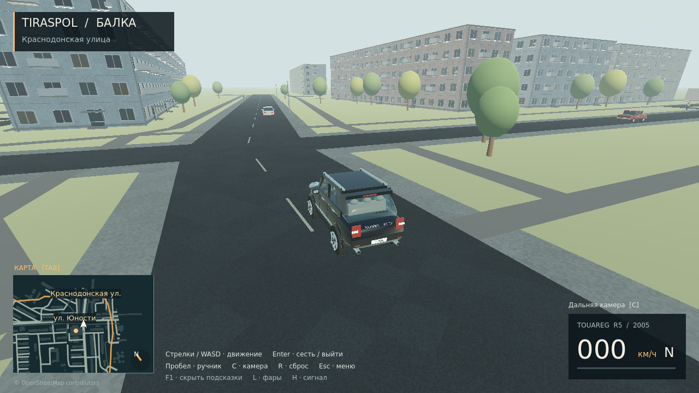
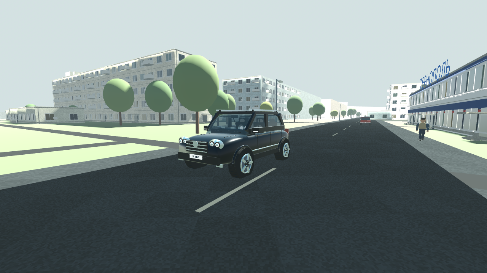
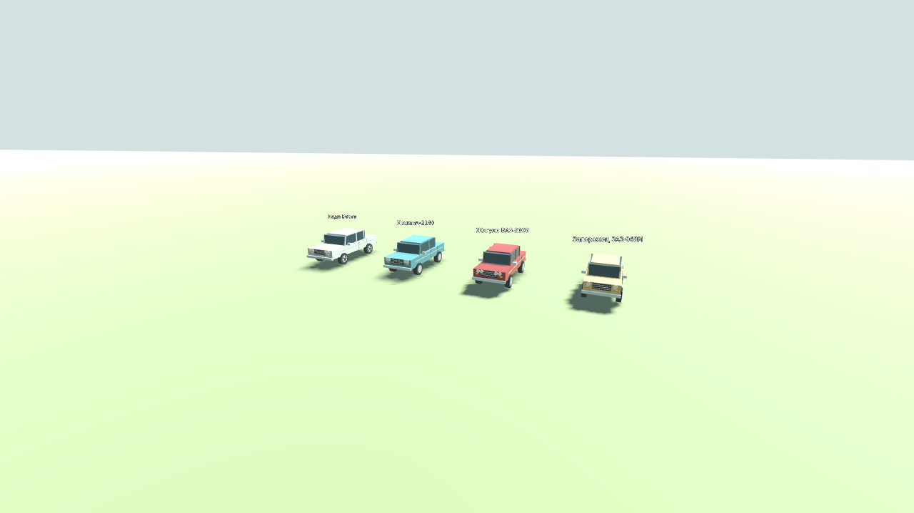

# GTA Tiraspol — Балка · v0.3

Независимый 3D-прототип прогулок и вождения по району Балка в Тирасполе. Godot 4.4.1, рендерер Compatibility, русский интерфейс. Проект не связан с Rockstar Games или Volkswagen; оригинальные ресурсы GTA не используются.

## Изменения v0.3

- Touareg: плавные поверхности кузова, прозрачные стёкла, отдельные линзы фар, детализированные сиденья, швы, дверные панели, кнопки, вентиляционные решётки, педали, ремни и задний диван. Исправлена ошибка объединения сеток, из-за которой пропадали панели кузова.
- Небольшой трафик: **ЗАЗ-968М «Запорожец», ВАЗ-2106 «Жигули», Москвич-2140 и современная Лада Веста**. Четыре отдельные упрощённые модели с разными пропорциями, оптикой и деталями.
- По умолчанию **8 машин и 12 пешеходов**. В настройках: пустой город / лёгкий трафик / 16 машин и 24 пешехода. Машины движутся по сегментам улиц, тормозят перед препятствиями; пешеходы идут вдоль дорог с анимацией ходьбы. При столкновении с пешеходом машина блокируется, без насилия и травм.
- Материалы асфальта, штукатурки и бетона, разные оттенки окон, межэтажные швы, водостоки, кондиционеры и вентиляция на крышах.
- Три профиля графики. Высокий включает тени и MSAA 4×; для UHD 620 начните с низкого и лёгкого трафика. FPS на пользовательском ноутбуке не измерялся.

**Рендеры:** `docs/Touareg_game_render.png` — настоящий кадр из Godot. `docs/Touareg_concept_render.png` — отдельный фотореалистичный концепт, созданный генерацией изображений; он не показывает фактическую графику игры. Игровые модели стали подробнее, но остаются процедурными, стилизованными, а не фотореалистичными копиями. Это не максимальная детализация профессиональной автомобильной 3D-модели.

**Ограничения движения:** базовая маршрутная логика, без полноценной симуляции ПДД и светофоров, посадки в NPC-машины или реакции пешеходов как в GTA. Дальние/застрявшие участники могут переставляться на маршруты. Положение NPC и повреждения столбов пока не сохраняются между запусками.

## Изменения v0.2

- Миникарта поворачивается по направлению машины/персонажа; курс всегда вверх. Большая карта остаётся севером вверх, колесо меняет масштаб, средняя кнопка перемещает её.
- Максимум 60 км/ч ограничен в физике. Разгон примерно 6,2 секунды до 60 при стандартной инерции.
- Все 640 деревьев имеют твёрдые стволы. Столбы гнутся от слабого удара, ломаются и падают от сильного или повторного.
- Более подробные колёса, арки, зеркала, швы дверей, выхлоп, дворники, приборы и руль. Персонаж получил лицо, пальцы, округлую геометрию, сгибание коленей/локтей.
- Объёмные окна, рамы, подоконники, балконы, входы, козырьки и карнизы. «Тернополь» получил бело-синий фасад с красной полосой и вывеской по просмотренному фото.
- Названия улиц, номера домов при увеличении карты; щелчок по дому показывает адрес и OSM ID. Адресные таблички видны на фасадах вблизи.

### Точность реконструкции

Это по-прежнему процедурный прототип. **Все 409 домов не были просмотрены и не восстановлены по фотографиям.** В проверенной части Google Maps доступны отдельные фотосферы, некоторые внутри помещений; сплошного покрытия у «Тернополя» не обнаружено. Просмотрены фотосфера «Зоолюкс» (2018) и фотография фасада «Тернополя» (2024). Геометрия остальных фасадов условная, даже если адрес известен. Для дальнейшего сопоставления приложен `docs/building_catalog.csv`: 409 объектов с OSM ID, адресом, координатами и статусом фотографии. Неизвестные номера не выдуманы. Фотографии Google в архив не включены.

## Запуск Windows 10/11 x64

1. Скачайте `GTA_Tiraspol_Windows_v0.3.0.zip` из [Releases](https://github.com/gridinwork/GTA_Tiraspol/releases).
2. Распакуйте весь архив, например в `F:\Game\GTA Tiraspol`.
3. Запустите `GTA_Tiraspol.exe`. Файл `.pck` должен оставаться рядом.
4. Для ярлыка на рабочем столе запустите `Create_Desktop_Shortcut.vbs`. Ярлык использует иконку чёрного Touareg. Права администратора не нужны.

Интернет, Python и редактор Godot для игры не нужны. Сборка не подписана цифровой подписью.

Версию 0.3 лучше распаковать в отдельную папку, чтобы сохранить предыдущую сборку. Ярлык создайте заново из новой папки.

## Управление

| Клавиша | Действие |
|---|---|
| WASD / стрелки | Ходьба, газ, тормоз/задний ход, поворот |
| Shift | Бег |
| Пробел | Прыжок пешком / ручной тормоз в машине |
| Enter | Сесть рядом с машиной / выйти после остановки |
| C | Переключить камеру, включая салон и капот |
| Мышь / правая кнопка | Обзор / вернуть камеру |
| Tab | Карта, щелчок показывает адрес и ставит ориентир |
| Колесо / средняя кнопка на карте | Масштаб / перемещение |
| R | Вернуть машину на дорогу |
| L / H | Фары / сигнал |
| F5 / F9 | Сохранить / загрузить позицию |
| F2 / F11 | Качество графики / полный экран |
| Esc / F1 | Меню / подсказки |

Настройки и сохранение находятся в `%APPDATA%\Godot\app_userdata\GTA Tiraspol`.

## Что есть в прототипе

Около 0,62 км², 409 контуров зданий и 276 участков улиц/дорожек по OpenStreetMap. Старт около Краснодонской улицы и ТЦ «Тернополь» / «Шериф-9». Ходьба, бег, посадка, вождение, ручник, столкновения, пять автомобильных камер, миникарта, большая карта, сохранение и настройки сцепления/инерции.

Машина — упрощённая процедурная модель чёрного внедорожника по мотивам Touareg первого поколения. Фасады, высоты без данных OSM, расположение деревьев и салон в основном условные. Граница района приблизительно перенесена с пользовательского контура. Миссий и фотореалистичной реконструкции пока нет.

Низкие настройки и 1280×720 выбраны для Intel UHD 620. Цель — 30 FPS; производительность на указанном ноутбуке ещё не измерялась. Функциональные тесты выполняются автоматически; они не заменяют проверку графики и управления на Windows.

## Исходники и сборка

Откройте `project/project.godot` в Godot **4.4.1**. Игровая логика: `project/scripts`; геометрия района: `project/data/district.json`. Модели персонажа и машины создаются в `player.gd` и `car.gd` и могут быть заменены импортированными сценами.

Установите официальные экспортные шаблоны Godot 4.4.1. Для иконки EXE выполните `build_tools/patch_icon.py` над Windows-шаблоном (Python, Pillow, LIEF). Экспорт: `godot --headless --path project --export-release "Windows Desktop"`. Полный воспроизводимый процесс приведён в `.github/workflows/build.yml`.

Тесты: `godot --headless --path project -- --test /absolute/path/report.json`.
Для пересборки карты: `pip install shapely`, затем `python build_tools/build_map.py`. Исходный OSM-экстракт сохранён в `build_tools/source_map.osm.gz`.

## Источники и лицензии

Карта © [OpenStreetMap contributors](https://www.openstreetmap.org/copyright), ODbL 1.0. Исходный экстракт и производная база `district.json` распространяются по [ODbL](https://opendatacommons.org/licenses/odbl/1-0/). Данные получены 4 октября 2026 г. через OSM API: bbox 29.65,46.83,29.68,46.85. Подложки Google Maps в игре нет.

Код проекта — MIT, см. `LICENSE`. Godot Engine — MIT; уведомления в `licenses/`. Шрифт DejaVu Sans с сокращённым набором символов — лицензия DejaVu/Bitstream, см. `licenses/DejaVu.txt`. Иконка создана генеративно для проекта; названия и марки принадлежат их владельцам.
